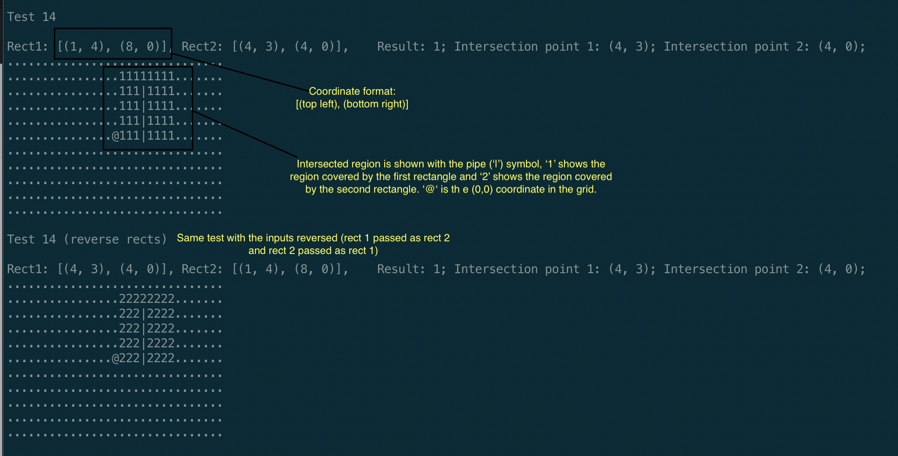

# rect-intersection
Given two rectangles, output if they intersect along with the intersection coordinates.

Each test displays the region covered by rect 1, rect 2 and the intersection rectangle (if any). The area covered by rect 1 is diplayed by the '1' character, the area covered by rect 2 is displayed by the '2' character, and the intersected area is displayed by the '|' character. Intersection is defined as a rectangle containing some part of the other rectangle. If a rectangle just touches the edge of the other rectangle, the rectangles are not considered to be intersecting.
